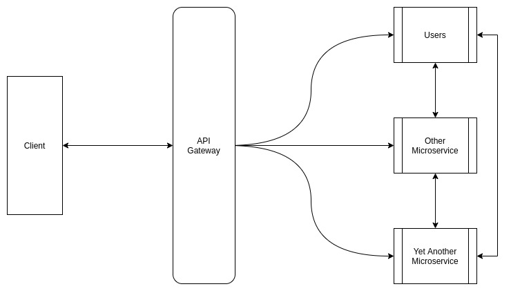

# MICROSERVICES BASIS [Gateway approach]

## Tech stack
- [fastapi](https://github.com/tiangolo/fastapi) - endpoints implementation
- [psql](https://www.postgresql.org/docs/9.3/app-psql.html) - main DB
- [sqlalchemy](https://www.sqlalchemy.org/) - ORM
- [alembic](https://alembic.sqlalchemy.org/en/latest/) - migrations
- [fastapi-jwt-auth](https://github.com/IndominusByte/fastapi-jwt-auth) - JWT Authentication
- [aiohttp](https://docs.aiohttp.org/en/stable/) - Asynchronous requests between microservices

## Functionality
Provided repo implements bare minimum functionality to build up microservice oriented project, that sticks to [gateway](https://microservices.io/patterns/apigateway.html) approach.
It includes:
- centralized jwt-authentication between microservices
- response post-processing
- CRUD for Users application

Existing functionality can be scaled by adding new services and scaling the gateway itself. Gateway microservice can be scaled by adding:
- response caching
- request pre-processing/data normalization
- response post-processing
- response composition from multiple services
- internal-use authentication/authorization
- etc.

## Gateway approach

> Little synopsis on gateway approach can be found [here](https://www.notion.so/Auth-microservice-central-based-f53ca23494de40e49bfa0067ce570fb1)

Current implementation of gateway microservice is decently simple. It knows response schemas, paths and expected status codes of all other microservices.
It implements custom wrapper on FastAPI route, that gives opportunity to centralize all requests and bind endpoints. Implementation of custom route is based on `aiohttp` core. So the gateway just decomposes received request and composes new one with custom additions and adjustments. Finally, it makes asynchronous request to internally available microservice and receives its response, if there is one, if not gateway handles this situation by returning `503 - Service unavailable`. Response received from service can be post processed if needed.

Gateway itself implements centralized JWT authentication by providing endpoints to fetch `access` and `refresh` tokens. In addition it has an endpoint to refresh expired `access-token`.



## How to use

```
docker-compose build
docker-compose run --rm users alembic upgrade head
docker-compose up
```

There is PGAdmin on `:5050` port for convenience of monitoring the data.
API docs are on `0.0.0.0:8001/docs` or `0.0.0.0:8001/redoc`

## Testing

Link to postman collection for testing each existing endpoint: https://www.getpostman.com/collections/ad9858b74404041fb58f. It consists of JSON content that needs to be imported to your Postman application.
